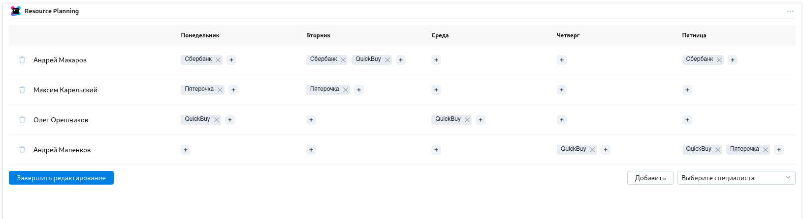

# Resource tracking plugin for YouTrack

YouTrack plugin that allows you to assign projects to a corporate member
per day of the week (monday - friday)

## ✨ Features
  - assign a project to a corporate member
  - allows assigning multiple projects per day
  - utilizes corporate API to get users/projects info

## Developing a Hub widget

  - `npm start` to run a local development server

To check your widget, go to the widget playground page located at `<your_hub_server>/youtrack/admin/hub/dashboard/widgets-playground`.

To upload widget, go to `<your_hub_server>/youtrack/admin/hub/widgets` page and click `New widget`

You may encounter the following problem when using a local development server together with Hub running over HTTPS: all major browsers block insecure scripts. 
In Chrome you can add a security exception: click the security notification in the address bar (the one saying "The page is trying to load scripts from unauthenticated sources") and 
press the "Load unsafe scripts" button. Similar workarounds are available in other browsers as well.
